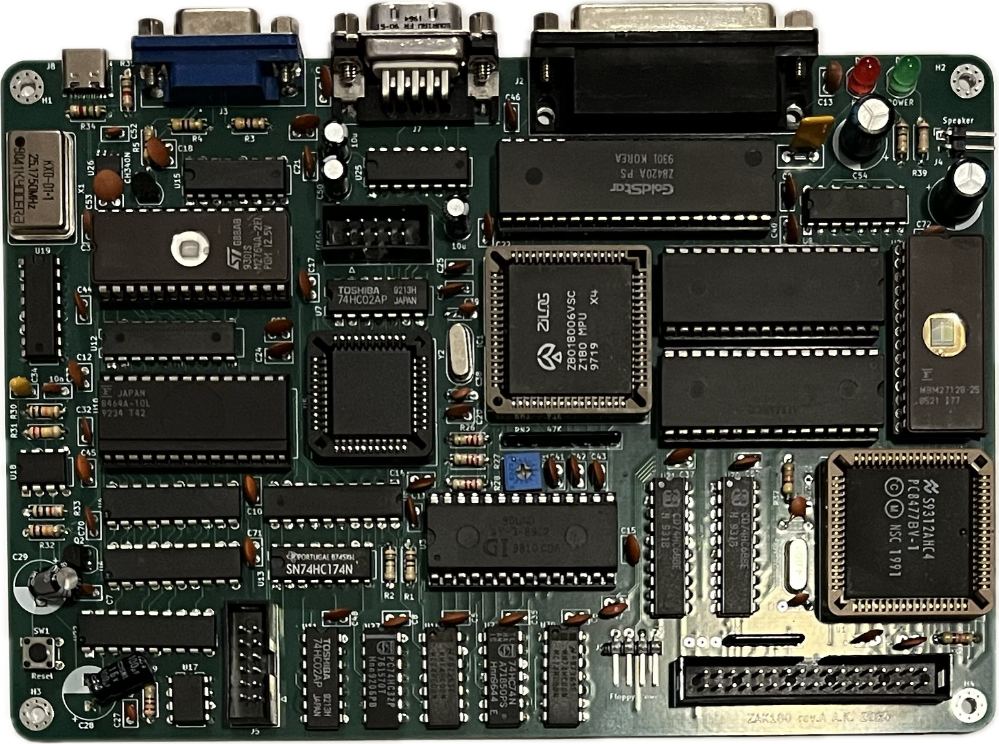
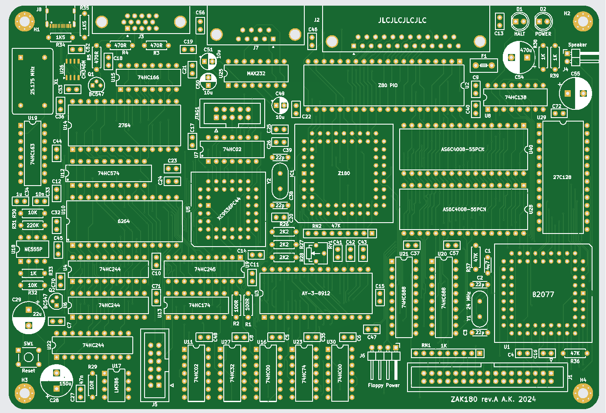

# ZAK180 computer

Work in progress.

## Hardware features

- Z180 CPU,
- 1 MB of static RAM,
- 16 KB bootloader ROM,
- Floppy disk drive,
- 16 bit GPIO user port,
- 2 UARTs: USB-C and RS232,
- AY-3-8912 sound,
- 80x60 B&W text mode VGA output,
- custom Cherry-MX mechanical keyboard,
- USB-C powered.

## Software features

ROM bootloader functions to load the kernel image from the 1.44 MB 3.5" FDD.
The kernel will a multi-tasking, preeptive in a monolithic architecture, with
UN\*X-like features (not even close to the full POSIX compability). Hopefully,
it will be possible to port some UN\*X applications (like vi), although limited
user process address space may be an obstacle (56 KB + 4 KB of stack).

## Repository structure

### datasheet

Collection of useful datasheets, might be removed in the future.

### firmware

#### bootloader

Source code of a simple EPROM bootloader. It prepares the platform, initializes
FDD and fetches the kernel image from the `/BOOT/KERNEL.IMG` file. Kernel is
loaded to the start of the physical address space (0x00000 onward, variable
size). Entry point of the kernel is assumed to be at the reset vector (i.e.
address 0x0000).

#### driver

ZAK180 peripheral drivers, both internal of Z180 MPU and present on the SBC.
This includes:

- Z180 ASCI,
- Z180 MMU,
- AY-3-8912,
- 82077,
- Z80 PIO,
- VGA.

#### filesystem

FAT12 read/write driver. Many characterics of the 1.44 MB floppy FAT12 variant
are hardcoded, with no current plans of generalization. LRU sector cache is
planned.

#### kernel

Source code of the kernel of the computer operating system.

#### test

Simple dead or alive SBC test. All it does is writing to the ASCI1 (USB-C) 
at 19200 bn1.

#### build.sh

Script to build all components of the firmware.

### keyboard2

Subrepository that contains a hardware project of a mechanical keyboard for the
computer.

### kicad

KiCAD project of the computer's PCB.

### vga

HDL of the VGA timing generator implemented in a XC9535 CPLD, tool to generate
font ROM.

### schematic.pdf

Schematic of the computer in a friendly .pdf form.

### 3dprint

3D models designed for FDM priting.

## Rev A

## License

[Attribution-NonCommercial 4.0](LICENSE)
